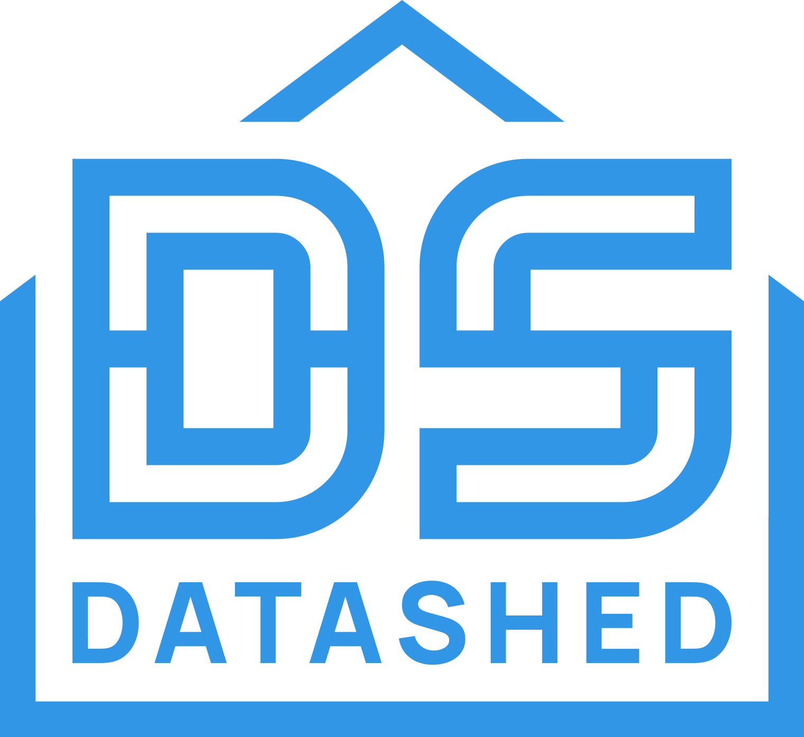

<p align="center">
  
</p>

<hr />

The _datashed tool_ is a _reverse ETL_ program that indexes the
documents it contains. Based on this index, data analyses can be carried
out, for example to identify corrupt documents or to build subsets based
on text statistical characteristics. Finally, the tool offers an HTTP
interface to assess the data quality of documents and reuse them as a
data source.

## Tour

### Creating a new datashed

The `init` command is used to create a new datashed project. The
following command creates a new project `demo`.

```console
$ datashed init demo
```

Alternatively, a project can be initialized inside an existing
directory:

```console
$ mkdir demo && cd demo
$ datashed init .
```

#### Project structure

An empty project consists of the following files and directories:

```console
$ tree demo
├── data
├── datashed.toml
└── tmp
```

The `data` directory contains the documents of the datashed. A document
must be in plain text format and end with the file extension `.txt`.
It is up to the user to set up an ingest process, e.g. in the form of a
Python script. Documents can be structured in any subdirectories within
the `data` directory.

#### Configuration

The `datashed.toml` contains metadata about the project and important
runtime options.

```toml
[metadata]
name = "demo"
version = "0.1.0"
authors = ["Jane Doe <jane.doe@example.com"]  
```

The metadata can be changed by command line options (see `datashed init
--help`). By default, the name of the project is the directory name,
the initial version is `0.1.0` and the author is derived from the Git
identity (if possible). The project is also automatically initialized
as a Git repository. This behavior can be deactivated using the `--vcs
none` option.

### Vocabulary

The `vocab` command can be used to create the vocabulary (dictionary
or lexicon) of the entire datashed or of any subset. With the help
of various filter options, the command can be used to create stop
word lists that are tailored to the entire population. Also the (raw)
features of subsets can be compared with each other.

The output contains the terms with the corresponding term frequency
(`tf`) and the document frequency (`df`).

In the following example, the vocabulary of all documents in the datashed
is created:

```console
$ datashed vocab -q -o vocab.csv
$ head -4 vocab.csv
term,tf,df
die,16,2
und,16,2
deutsche,8,3
```

To use two or three adjacent words as vocabulary terms, the options
`--bigrams` / `-b` or `--trigrams` / `-t` can be used:

```console
$ datashed vocab -q --bigrams | head -3
term,tf,df
die tib,5,1
die deutsche,4,2
```

Using the `--stopwords` / `-S` option, all terms that appear in a
stopword list can be removed in advance:

```console
$ echo "die\nund\n" >> STOPWORDS.txt
$ datashed vocab -q -S STOPWORDS.txt | head -4
term,tf,df
deutsche,8,3
in,8,3
the,8,1
```

The option `--category` (`-L`) can be used to include only those
terms where at least on character belongs to the specified unicode
category. The following categories are available:

* `a` (`all`) —  "Letter" category _Lc_, _Ll_, _Lm_, _Lo_, _Lt_, _Lu_,
* `l` (`lowercase`) — "Letter, Lowercase" category _Ll_,
* `u` (`uppercase`) — "Letter, Uppercase" category _Lu_,
* `t` (`titlecase`) — "Letter, Titlecase" category _Lt_,
* `m` (`modifier`) — "Letter, Modifier" category _Lm_,
* `o` (`other`) — "Letter, Other" category _Lo_.

In addition, the vocabulary can be further restricted by the
`--min-term-length`, `--min-term-freq`, or `--min-doc-freq` options.


### Grepping

A simple form of document retrieval is a linear search for patterns.
This function is provided by the `grep` command. It works in a similar
way to the Unix `grep` or `rg` command, but it supports other practical
functions.

Only the documents that have been indexed in Datashed are searched.
The output contains all lines from the index where the corresponding
document matches one of the specified patterns. By default, the output
is written in CSV format on the console.

In the following example, the documents are searched for the phrase
_"(DNB)"_:

```console
$ datashed grep -q '\(DNB\)'
path,hash,ppn,size,mtime
0/dnb.txt,71eb6431,dnb,769,1750321974
```

The index can be restricted in advance according to conditions. If, for
example, only documents with a file size of less than 1 KiB are to be
searched, this is done using the `--where` option:

```console
$ datashed grep -q '\(DNB\)' --where 'size <= 1024'
path,hash,ppn,size,mtime
0/dnb.txt,71eb6431,dnb,769,1750321974
```

Another useful option is the restriction to a search window. If only
the first _n_ bytes are to be searched, this is done by specifying the
`-n` option:

```console
$ datashed grep -q -n 50 '\(DNB\)'
path,hash,ppn,size,mtime
0/dnb.txt,71eb6431,dnb,769,1750321974
```

### Versioning

It is good practice to track changes to a project's database with
version numbers. Using the `version` command, the version of the project
can either be changed or incremented. The version must follow the
[Semantic Versioning](https://semver.org/) guidelines.

The current version of the project can be queried as follows:

```console
$ datashed version
0.1.0
```

The following command changes the version of the project to the value
`0.2.0`. Note, that unless the `-f` (`--force`) flag is set, the new
version must always be greater than the current version.

```console
$ datashed version 0.2.0
```

It is also possible to increment only the _major_, _minor_ or _patch_
version:

```console
$ datashed version --bump major
$ datashed version --bump minor
$ datashed version --bump patch
```

### Archive and Restore

The `archive` command can be used to create a backup of a datashed. It
creates a `tar.gz` archive containing all documents, the configuration
and the current index. It is important to note, that only the documents
contained in the index are archived. If there are documents that have
not yet been indexed, the index should be updated first. By default,
the compression is biased towards high compression ratio at expense of
speed. This behavior can be changed using the `--fast` or `--best` flag.

```console
$ datashed archive -o ~/tmp/backup.tar.gz
Archive documents: 3 (100%) | elapsed: 00:00:00, done.
```

An archive can be restored either via the `tar` program or by using
the `restore` command. By default, the archive is restored inside the
current directory. If the archive is to be unpacked into a different
directory, this can be specified with the `-C` (`--directory`) option.
The new  directory is created automatically if it does not yet exist.

```console
$ datashed restore ~/tmp/backup.tar.gz -C foobar
Successfully restored archive.
Verify consistency with `datashed verify`.
```
